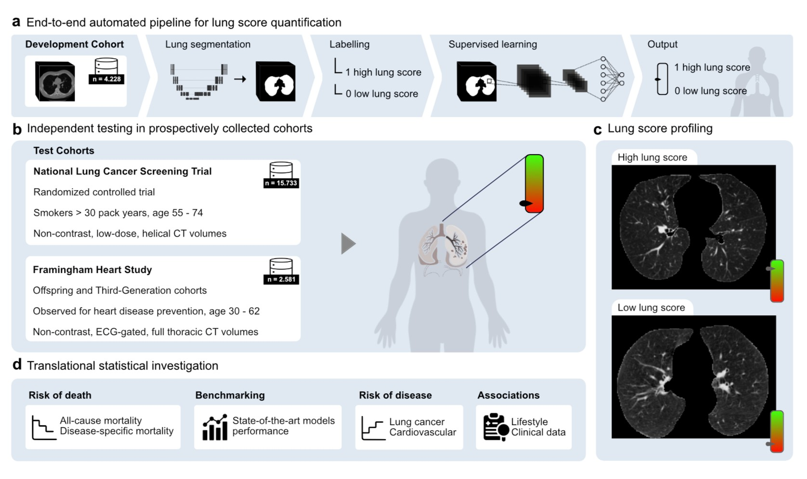
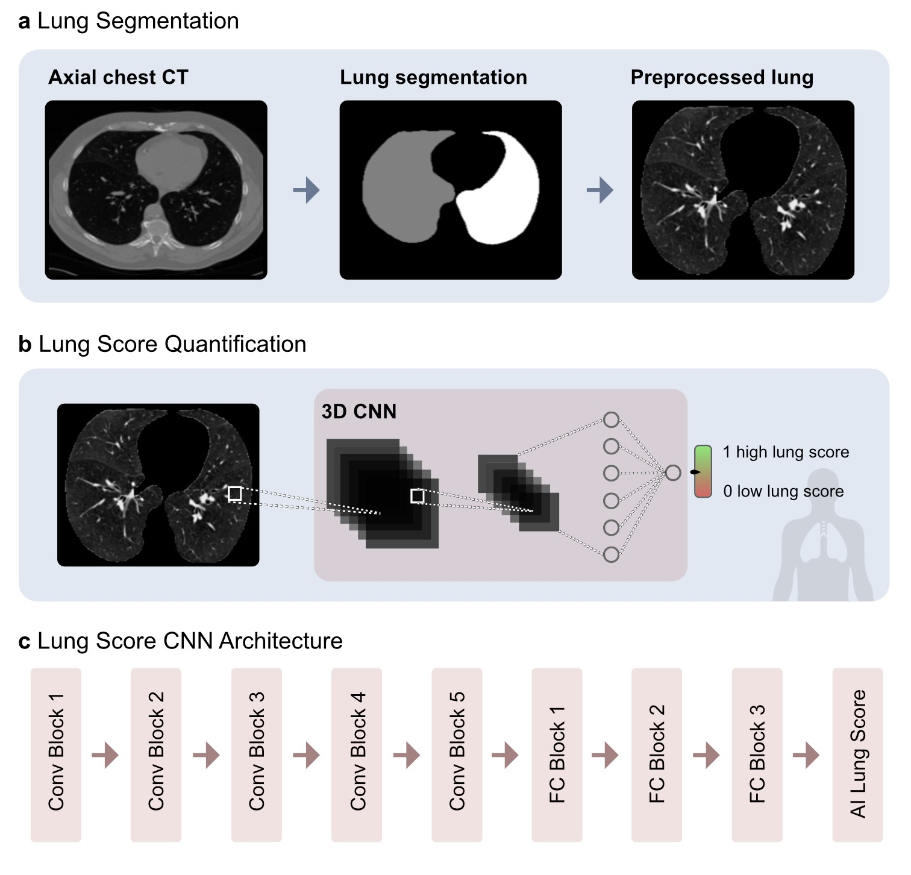

<!DOCTYPE html>
<html lang="en">
<head>
  <meta charset="UTF-8">
  <meta name="viewport" content="width=device-width, initial-scale=1.0">
</head>
<body>

<h1><b>AI-based Radiographic Lung Score Associates with Clinical Outcomes in Adults</b></h1>

Official implementation of "LungScore": An AI-based radiographic score of lung integrity applicable to all adults, including non-smokers and those without overt disease.

 

<h2>Repository Structure</h2>

This repository is structured as follows:

<ul>
  <li>
    <strong>📂 LungScore/</strong>
    
Folder stores the code used to train and test the pipeline.

    <ul>
  <li>
    <strong>📂 stats_analysis/</strong>
    
Contains R scripts used to evaluate the association between the LungScore and clinical outcomes, and to export the plots in the Manuscript.

  </li>
  <li>
    <strong>📂 config/</strong>
    
Contains <code>.yaml</code> Files that define all hyperparameters and paths, to reproduce the entire LungScore pipeline.

  </li>

</ul>

<h2>Environment Setup</h2>

<h2>Run the model</h2>

To run Lung Score on you dataset

The model works on axial chest (LD)CT scans.

    # Step 1: Install all our dependencies:
    pip install LungScore --pre

    # Step 2: Import Lung score functions
    from LungScore.run import preprocess_nrrd, segment_lung, preprocess_lung, lungscore_load, lungscore_predict, predict_lungscore_riskcategory

    # step 3: preprocess nrrd and segment the lung by passing nrrd_file_path --ex: nrrd_path="/mnt/data/123img.nrrd"
    nrrd = preprocess_nrrd(nrrd_path)
    lungmask = segment_lung(nrrd) 

    # step 4: preprocess lung 
    preprocessed_lung = preprocess_lung(lungmask, nrrd)

    # step 5: load Lung Score model weights
    model = lungscore_load()

    # step 6: predict Lung Score (score from 0 t0 1 -- 1 is least impaired lung)
    ai_lung_score = lungscore_predict(model, preprocessed_lung)

    # step 7: predict risk group based on Lung Score splits (very low, low, moderate, high, very high)
    risk_group = predict_lungscore_riskcategory(ai_lung_score)

    # you can combine all in one step by:
    from LungScore.run import AILungscorepredict
    ai_lung_score, risk_group = AILungscorepredict(nrrd_path)

<h2>Replicating Lung Score Pipeline</h2>
<h3>Training Pipeline</h3>

<h3>Inference Pipeline</h3>

<h2>Lung Score Model</h2>
<h3>Model Development</h3>

  The <strong>LungScore</strong> is a deep learning–derived biomarker designed to quantify structural lung integrity from chest CT scans. Lung Score pipeline consists of two stages:

<ol>
  <li><strong>Lung Segmentation:</strong> Automated delineation of the pulmonary parenchyma using the <a href="https://github.com/JoHof/lungmask">Lungmask</a>.</li>
  <li><strong>Lung Score Quantification:</strong> The segmented 3D lung volume is input into a 3D Convolutional Neural Network (3D CNN). The model processes the entire pulmonary structure to output a continuous score (0 to 1), providing a global measure of lung integrity with lower values corresponding to relatively more impaired lung structure.</li>
</ol>

  
Click to view Model Training and Hypothesis

  

    The LungScore was developed using a supervised 3D Convolutional Neural Network (3D CNN) trained on a curated subset of 4,228 NLST participants. In the absence of a definitive ground-truth measure for lung integrity, the training signal was derived from a hypothesized gradient of structural variation.
  

  

    <strong>Hypothesis:</strong>
    The training cohort utilized participants at opposite ends of lung structural health (highest quartile of smoking exposure versus lowest quartile of smoking exposure with no CT chronic findings). Crucially, <strong>both groups consisted of smokers</strong>; this was intended to encourage the model to identify imaging-derived structural features rather than simply learning to distinguish smoking status, thereby <strong>potentially reducing confounding</strong> by smoking history.
  

  

    By capturing these shared morphological signatures, the model <strong>potentially</strong> identifies a continuous gradient of lung integrity that may maintain its prognostic relevance across diverse clinical profiles—including individuals with varying smoking histories, non-smokers, and those both with and without overt lung disease.
  

 

<h3>Model Validation</h3>

  The LungScore was validated by its ability to associate with clinical outcomes across two independent, large-scale cohorts:

<ul>
  <li><strong>Internal Validation:</strong> A held-out test set from the NLST (n = 15,733).</li>
  <li><strong>External Validation:</strong> The Framingham Heart Study (FHS) cohort (n = 2,581).</li>
</ul>

  <strong>Outcome Association:</strong>
  To assess the score's prognostic relevance, we analyzed its association with <strong>all-cause mortality</strong>, as well as lung cancer incidence and cardiovascular-specific mortality. 

  <strong>Stratification:</strong>
  Participants were categorized into five groups based on percentile cutoffs derived from the NLST tuning cohort:

<ul>
  <li><strong>Very Low:</strong> ≤5th percentile</li>
  <li><strong>Low:</strong> 5th–25th percentile</li>
  <li><strong>Moderate:</strong> 25th–50th percentile</li>
  <li><strong>High:</strong> 50th–75th percentile</li>
  <li><strong>Very High:</strong> ≥75th percentile</li>
</ul>

<h2>Statistical Analysis</h2>

  All statistical modeling was performed using <strong>R version 4.2.2</strong>. The association between the LungScore and clinical outcomes was assessed through:

<ul>
  <li><strong>Survival Analysis:</strong> Kaplan–Meier estimates and log-rank tests were used for univariate comparisons.</li>
  <li><strong>Risk Modeling:</strong> Multivariable Cox proportional hazards models, adjusted for age, sex, BMI, smoking history (pack-years), and pre-existing comorbidities.</li>
  <li><strong>Proportional Hazards:</strong> Assumptions were verified using Schoenfeld residuals, with age- and sex-stratified models implemented to address non-proportionality.</li>
  <li><strong>Independence Testing:</strong> Multicollinearity was ruled out using Variance Inflation Factors (VIF < 5) and partial correlation analyses.</li>
</ul>

<h2>Datasets</h2>

  The LungScore was trained on the <strong>National Lung Screening Trial (NLST)</strong> and tested on a held-out test set from NLST and an external dataset from the <strong>Framingham Heart Study (FHS)</strong>. These datasets can be requested through official repositories as follows:

<ul>
  <li><strong>National Lung Screening Trial (NLST): </strong><a href="https://biometry.nci.nih.gov/cdas/nlst/">NCI CDAS</a>.</li>
  <li><strong>Framingham Heart Study (FHS): </strong><a href="https://biolincc.nhlbi.nih.gov/">BioLINCC</a>.</li>
</ul>

<h3>Image Pre-processing</h3>

  Standardization of heterogeneous CT data was performed to ensure consistency across cohorts. The following pipeline was applied to baseline axial CT series from both NLST and FHS:

<ul>
  <li><strong>Series Selection:</strong> We prioritized series with a slice thickness closest to 2.5 mm (range: 0.625–3.27 mm). In cases of multiple candidates, the series with the softest reconstruction kernel was selected.</li>
  <li><strong>Format Conversion:</strong> DICOM files were converted to NRRD format using the <code>SimpleITK</code> library.</li>
  <li><strong>Resampling:</strong> All volumes were resampled to a fixed isotropic resolution of 0.68 x 0.68 x 2.5 mm³.</li>
</ul>

<h3>Data Split and Cohort Selection</h3>
<ul>
  <li><strong>Development Set (NLST, n = 4,228)
    <ul>
      <li><em>Group 1 (More Impaired Lung):</em> Highest quartile of smoking exposure (>66 pack-years).</li>
      <li><em>Group 2 (Less Impaired Lung):</em> Lowest quartile of smoking exposure (&lt;42 pack-years) with no chronic CT findings.</li>
    </ul>
    This subset was split 70:30 into training and tuning sets.
  </li>
  <li><strong>Internal Test Set (NLST, n = 15,733):</strong> A held-out portion (65% of the total cohort) reserved for independent validation.</li>
  <li><strong>External Validation (FHS, n = 2,581):</strong> An independent cohort used exclusively to evaluate model generalizability.</li>
</ul>

<h2>Disclaimer</h2>

The code and data of this repository are provided to promote reproducible research. They are not intended for clinical care or commercial use.

The software is provided "as is", without warranty of any kind, express or implied, including but not limited to the warranties of merchantability, fitness for a particular purpose and noninfringement. In no event shall the authors or copyright holders be liable for any claim, damages or other liability, whether in an action of contract, tort or otherwise, arising from, out of or in connection with the software or the use or other dealings in the software.

<h2>Contact</h2>

We are happy to help you. Any question regarding this repository, please reach out to ahassan12@bwh.harvard.edu and haerts@bwh.harvard.edu.

</body>
</html>

